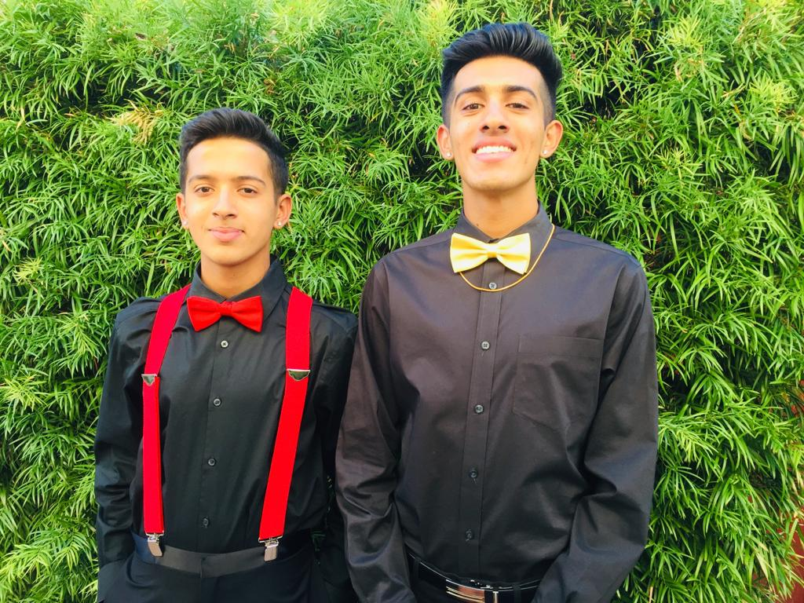

# Shasta Subramanian's User Page

## About Me
I'm a motivated engineering student who is passionate about learning. I have interests in robotics, artificial intelligence, embedded systems, business, and finance. Still trying to figure out exactly where I want to go with my career.

### Third Year ECE Computer Engineering Student
### Fall 2022 Coursework
- **CSE 101**: *Design and Analysis of Algorithms*
- **CSE 110**: *Software Engineering*
- **ECE 158A**: *Data Networks I*   
- **COGS 108**: *Data Science Principles*

<u>This is a pretty good basketball team.</u>

### Outside of Classes
> I try my best to fit in some time to get involved with some technological research labs on campus. In particular, I have worked with the WCSNG and Wang Robotics Lab but am working towards a new position at the Advanced Robotics and Controls Lab.
> I enjoy hanging out with my friends in my free time, cooking and eating new foods, playing video games (COD Zombies), skateboarding, going on hikes, and traveling.

### Past Work Experience
1. Amazon, Hardware Development Engineer Intern, Summer 2022
2. Ventana Research, Industry Analyst Intern, Summer 2021
3. theCoderSchool, Computer Programming and Robotics Instructor, 2021
4. Cliosoft, Software Development Intern, 2021

### Miscellaneous
My favorite git command is `git diff` since it helps me quickly see which file changes have not been staged yet.
Here is a link to [My LinkedIn Profile](https://www.linkedin.com/in/shasta-subramanian/) if anyone is interested.

#### Personal To Do List
- [x] Get into a good college
- [x] Skydiving
- [x] Be happy
- [ ] Make millions of dollars
- [ ] Get all As this quarter
- [ ] Develop a new, innovative solution in the world
- [ ] Get better at surfing